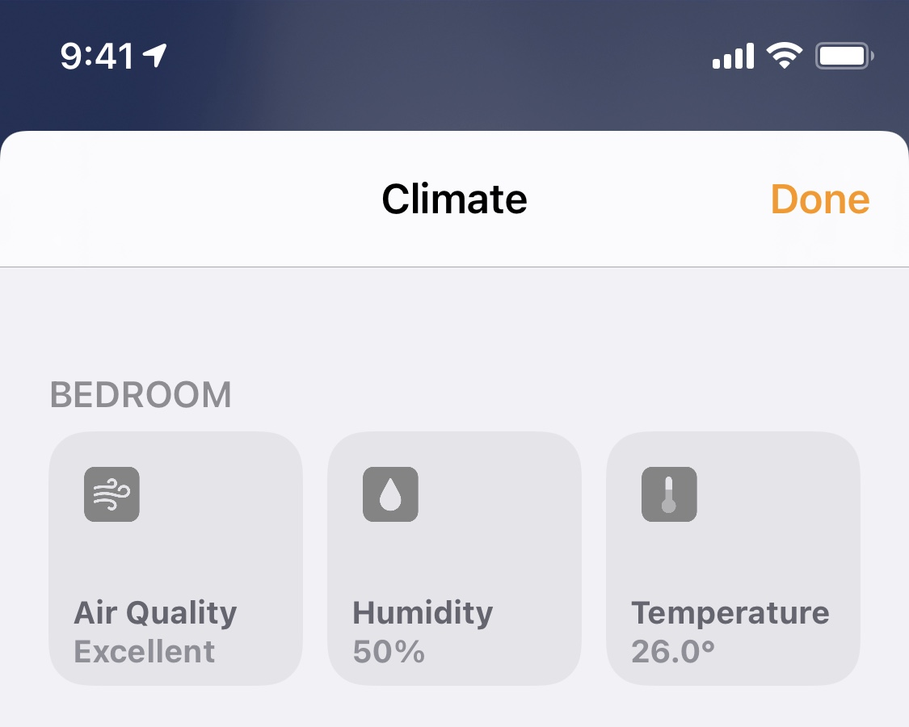
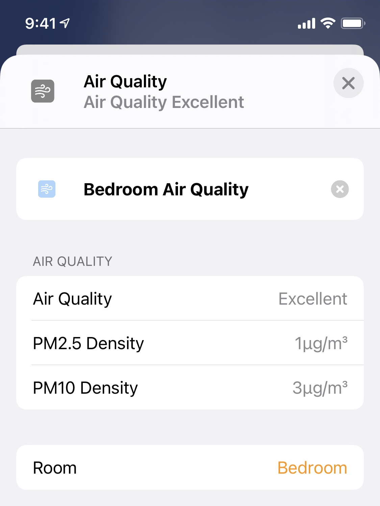

# homebridge-influx-air 


A Homebridge plugin that exposes temperature, humidity, and air quality from an InfluxDB instance.

This project is forked from and inspired by:

- [tiphedor/homebridge-influxdb-temperature-humidity](https://github.com/tiphedor/homebridge-influxdb-temperature-humidity/).
- [lucacri/homebridge-http-temperature-humidity](https://github.com/lucacri/homebridge-http-temperature-humidity/)

## Install

Install the plugin using:

```bash
npm i -g homebridge-influx-air
```

You may have to use either `sudo` or `--unsafe-perm`, or both, depending on your environment.

## Configure

Add to the `accessories` field of your Homebridge `config.json` file (default location at `~/.homebridge/config.json`) :

```
{
  ...
  "accessories": [
      ...
      {
        "accessory": "InfluxAir",
        "name": "Air Sensors",  // Name for the combined sensor

        // Optional names for each sensor
        "sensor_names": {
          "temperature": "Temperature Sensor",
          "humidity": "Humidity Sensor",
          "air_quality": "Air Quality Sensor"
        },

        // For influxDB queries
        "schema": {
          "temperature": {
            "field": "temperature",
            "measurement": "air"
          },
          "humidity": {
            "field": "humidity",
            "measurement": "air"
          },
          "air_quality": {
            "fields": {
              "pm2_5": "pm25",
              "pm10": "pm100"
            },
            "measurement": "pm"
          }
        },
        "influx": {
          "host": "127.0.0.1",
          "database": "homeserver"
        }
      }
    ]
}
```

Learn more at [config.sample.json](./config.sample.json).

The `influx` configuration object is passed as-is to the `influx` npm library, so you can use all the options it supports. See [here](https://node-influx.github.io/class/src/index.js~InfluxDB.html#instance-constructor-constructor)

## Screenshots






## Data

[](https://github.com/xtai/py-influx-air)
For how to generate these data, see [https://github.com/xtai/py-influx-air](https://github.com/xtai/py-influx-air).
